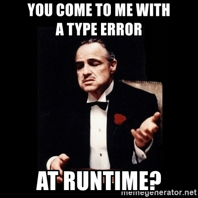

% Intro to<br>Learning Scala
% *Bangkok Functional Programmers*
% *May 17th, 2017*

Yours Truly  {style="text-align: left;"}
-----------

<i class="fa fa-github fa-lg fa-fw" aria-hidden="true"></i> [ches][github]

<i class="fa fa-twitter fa-lg fa-fw" aria-hidden="true"></i> [ches][twitter]

<i class="fa fa-id-badge fa-lg fa-fw" aria-hidden="true"></i> [chesmart.in][site]

<i class="fa fa-meetup fa-lg fa-fw" aria-hidden="true"></i> [meetup.com/bkkhack][bkkhack]

[site]: http://chesmart.in
[github]: https://github.com/ches
[twitter]: https://twitter.com/ches
[bkkhack]: https://www.meetup.com/bkkhack/

Why Scala?
==========

<div class="notes">
In this talk I'm going to focus more on what I think are pragmatic answers to
this than functional programming-specific answers, but they intersect.
</div>

Multi-Paradigm
--------------

> - Your personal on-ramp to FP
> - A Trojan Horse for FP into your company

<div class="notes">
"Scalable Language", OOP + functional, functions are objects!

This does bring a learning curve. But IMO Scala gets a bad rap as a "big"
language, actually many "language features" are library features, not syntax.
For example, Map `->` syntax.

FP as "programming in the small", modules and OOP "programming in the large"
</div>

Long Live the JVM
-----------------

  - The JVM is pervasive, mature, and performant
  - Statically-typed benefits,\
    dynamic language comforts
    - Type inference
    - REPL
    - Everything is an expression

<div class="notes">
Say what you will about Java showing its age, but the JVM remains one of the
top runtime platforms for good reasons, and continues to develop in support
of new hosted languages.

Obviously widely deployed in enterprise, where it's well-understood by IT.

Java interop and useful libraries.
</div>

...But
------

> - [Scala.js] is production-ready.
> - [Scala Native][] (LLVM) is underway.
> - (Hooray for a defined [language specification]).

<div class="notes">
RIP .NET CLR

- Interoperate with JS statically and dynamically
- All your IDE features, many of your Scala libraries
- Not just for the browser—think Node, React Native, AWS Lambda, etc.
- Cool to see abstractions like Futures implemented on JS primitives.
</div>

[Scala.js]: https://www.scala-js.org/
[Scala Native]: http://scala-native.org/
[language specification]: https://www.scala-lang.org/files/archive/spec/2.12/

Community
---------

  - Open Source
  - Industry
  - Academia
  - [Scala Center](https://scala.epfl.ch/)

<div class="notes">
- Language has a published specification and is open
- Typesafe / Lightbend and commercial support ecosystem
- EPFL, Scala Center, Typelevel community + scalac
</div>

❤️ Martin
--------

{width=60%}

<div class="notes">
A language community is blessed to have someone with Martin's rare blend of
brilliant creator + warmth and gifted passion for teaching.

Founder and chairman of Typesafe née Lightbend, professor at Ecole
Polytechnique Fédérale de Lausanne (EPFL) in Switzerland.

Wrote javac compiler v2 released in 1999, still the basis of javac today, plus
the precursor of Java 5 generics.
</div>

Concurrency & Streams
---------------------

  - Modern abstractions built on JVM's\
    proven primitives
  - Futures, parallel collections
  - Actors
  - Rx, Reactive Streams
  - Monix, FS2 née scalaz Streams, FRP
  - In the large: Spark

<div class="notes">
Akka (but don't be too easily seduced—Actors sacrifice type safety and
functional benefits in a tradeoff that isn't worth it unless building a system
with actual distributed state)

FRP - Functional Reactive Programming, see e.g. Elm language and one-way data
flow like Redux (someone should give a meetup talk about either of these!)
</div>

Progressive Research
--------------------

  - Alternative runtimes
  - Macros: compile-time metaprogramming
  - [DOT calculus], dotty, Scala 3

<div class="notes">
scala-logging is a very practical example for macros.

Yeah yeah Clojure devs, we're not homoiconic, but you're dynamically-typed :-P
</div>

[DOT calculus]: http://www.scala-lang.org/blog/2016/02/03/essence-of-scala.html

The Gateway Drug
================

Lead a Horse to Water
---------------------

  - Scala makes immutable the default
  - There is no `null` (except for the sake of Java)
  - Everything is an expression, remember?
  - Algebraic Data Types (sit tight)

<div class="notes">
`Option` type becoming more familiar: Swift, Rust, OCaml, Haskell's `Maybe`
</div>

-----



-----

A rich, powerful type system enables you\
to design more error-proof APIs.

Algebraic Data Types
--------------------

Sum Types
---------

Elegant in Haskell:

```haskell
data Bool = False | True
```

Noisier in Scala:

```scala
sealed trait Bool
final case object False extends Bool
final case object True extends Bool
```

Product Types
-------------

The venerable `Tuple`:

```scala
val ches: Tuple2[String, Int] = ("Ches", 34)
```

And its richer cousin, the `case class`:

```scala
case class Person(name: String, age: Int)
// Actual type ends up being:
// case class Person extends Product with Serializable

Person.tupled(ches) // => Person = Person(Ches,34)
```

-----

These sums and products compose,\
that's the "algebra".

```scala
/* (Slightly simplified from the true Scala Option type) */
sealed abstract class Option[A]
case object None extends Option[Nothing]
final case class Some[A](value: A) extends Option[A]
```

Functions as Objects
--------------------

```scala
package object logging {
  type Tags = Map[String, String]
}

package logging {

  /** Tags associated with a logged metric. */
  object Tags {
    def apply(elems: (String, String)*): Tags = Map(elems: _*)

    def empty: Tags = Map.empty
  }
}
```

<div class="notes">
TODO: this is not the best example of what the slide title says, which should
probably show functions as `FunctionN` traits, maybe `PartialFunction`, etc.

This was instead a code sample I happened to paste from real work code to test
syntax highlighting, and kept it as an example of type aliases and package
objects when running short on time :-)
</div>

Practical Macros: Logging
-------------------------

```scala
logger.debug(s"Some $expensive message!")
```

becomes:

```scala
if (logger.isDebugEnabled)
  logger.debug(s"Some $expensive message!")
```

\
<small><https://github.com/typesafehub/scala-logging></small>

<div class="notes">
I promised an example of compile-time metaprogramming that isn't mind-melting
voodoo.
</div>

The Typeclass Pattern
---------------------

> - Ad hoc polymorphism (what?)
> - This is a deep talk, maybe another Meetup <i class="fa fa-smile-o" aria-hidden="true"></i>
> - Familiar with typeclasses?\
    (You probably learned Haskell).\
    You may want to look at Cats & scalaz.

Resources
=========

Warming Up <i class="fa fa-fire" aria-hidden="true"></i>
----------

<p style="text-align: left;">
  <cite>[_Programming in Scala, 3rd ed._][odersky] – <br>Odersky, Spoon, Venners</cite>
  ("the Stairway Book")
</p>

<p style="text-align: left;">
  <cite>[_The Neophyte's Guide to Scala_][westheide] – Daniel Westheide</cite>
</p>

<p style="text-align: left;">
  <cite>[_Scala's Types of Types_][malawski] – Konrad Malawski</cite>
</p>

<p style="text-align: left;">
  Find Li Haoyi's trove like <cite>[_Hands-on Scala.js_][haoyi]</cite>
</p>

Getting Serious <i class="fa fa-book" aria-hidden="true"></i>
---------------

[EPFL Scala specialization on Coursera](https://www.coursera.org/specializations/scala)

Finding Libraries <i class="fa fa-code-fork" aria-hidden="true"></i>
-----------------

[Scala Library Index](https://index.scala-lang.org/)

Hardcore FP <i class="fa fa-graduation-cap" aria-hidden="true"></i>
-----------

<p style="text-align: left;">
  <cite>[_Functional Programming in Scala_][chiusano] – <br>Chiusano, Bjarnason</cite>
  ("the Red Book")
</p>

<p style="text-align: left;">
  <cite>[Typelevel Blog][typelevel]</cite>
</p>

<p style="text-align: left;">
  <cite>[scala-exercises.org](https://www.scala-exercises.org/)</cite>
</p>

<p style="text-align: left;">
  <cite>[herding cats] – Eugene Yokota</cite>
</p>

[odersky]: https://www.artima.com/shop/programming_in_scala_3ed
[westheide]: http://danielwestheide.com/scala/neophytes.html
[malawski]: http://ktoso.github.io/scala-types-of-types/
[haoyi]: http://www.lihaoyi.com/hands-on-scala-js/
[chiusano]: https://www.manning.com/books/functional-programming-in-scala
[typelevel]: http://typelevel.org/blog/
[herding cats]: http://eed3si9n.com/herding-cats/

Workshop Time
=============

REPL Workout!
-------------

<span class="fa-stack fa-lg">
  <i class="fa fa-square-o fa-stack-2x"></i>
  <i class="fa fa-terminal fa-stack-1x fa-inverse"></i>
</span>

  - Please ask questions. Please.
  - Try stuff!
  - Remind me about sbt.
  - I could go on for awhile, leave if you gotta.

<div class="notes">
Show `:help`, `:load`, `:type`, `:javap -sysinfo` for a case class
</div>
